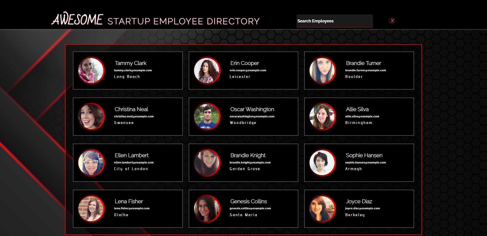

# Treehouse FEWD TechDegree  - Employee Directory Project

This is my eighth project for the [Front End Web Development Techdegree at Treehouse](https://teamtreehouse.com/techdegree/front-end-web-development).

### Description
Communicating with an API to build a prototype for a company of an employee directory of employees to share contact information.

Communicating with APIs allows you to work with microservices and with vast databases to build useful tools and relevant information quickly and easily.

## Table of contents
- [Overview](#overview)
  - [About this project](#about-this-project)
  - [Screenshot](#screenshot)
  - [Link](#links)
- [Process](#my-process) 
  - [Technologies used](#technologies-used) 
  - [What I learned](#what-i-learned) 
  - [Continued development](#continued-development) 
  - [Useful resources](#useful-resources) 
- [Author](#author) 
- [Acknowledgments](#acknowledgments) Coming Soon

## Overview
  
### About this project

### Screenshot of my project 8 desktop


**Using photos and information that the API provides. I will display 12 users, along with some basic information:**
- Image
- First and Last Name
- Email
- City

Users should be able to:

- A mobile-first approach is utilized using min-width properties for media queries.
- Search for employees
- Modal to view all contact details for an employee

#### Exceeds Requiremnts
- **Exceeds**: Add a way to filter the directory by name. To do this, I will need to request a random user nationality that will only return data in the English alphabet. 
- **Exceeds**: Add a way to move back and forth between employee detail windows when the modal window is open.

### Live Link
- Live Site URL: [Project 8 Awesome Employee Directory](https://samatkinsonmodeste.github.io/Project-8-API-Employee-Directory/)

## My Process
First, I read through all the requirements for this project.
Then I saved all the links provided in my browser's favourites.
I then used my best friend Google to google how to do some of the extras I wanted to add.
I would like to say when it came to coding, I planned every step, so not the case! 😀
I start by experimenting with the css as well as the javascript, and then when I felt like I had a feel for things, I organically transition into the actual code of the project.
### Technoliges Used
- Semantic HTML5 markup
- CSS Grid
- CSS Flexbox
- SVG
- JavaScript
- Fetch [Random User Generator](https://randomuser.me/) - API of Random Users
- Photoshop - Created my own favicon
- Favicon [Favicon Generator](https://www.favicon-generator.org/) - The Favicon Generator App where I upload my created favicon

### What I Learned
How easy it is to use Fetch to get data from an API. The hard part was then using the data, which was a challenge. So I learnt to target the little HTML I had as well as using an empty array to push all the data from the API to. By console.logging the array, I was able to see how the data was formatted.
 I learnt the difference between:
```js
searhInput.addEventListener('click', myInput);
// And
searchInput.onfocus = function () {};
```
The difference is with the 2nd version multiple events can not be associated with an element as they will be overwritten. 

I also learnt if you don't want the browser's default dropdown for datalists you leave the value for the input's list attibute as an empty string.
I was proud of my hover state on my employee divs. I had so much fun creating them.
```css
    .employee:hover .details .city,
    .employeeData:hover .details .city {
        transform: scale(0.8) translate(44px, -5px);
        letter-spacing: 0.1rem;
    }

    .employee:hover .image,
    .employeeData:hover .image {
        transform: scale(0.8) translate(-21px, -46px);
    }
```

### Continued Development

If I don't nail my keyup function then better understanding on creating a keyup event for a datalist and it's options. I absolutely want to continue growing with my javascript skills. 

### Resources
- [Demo Of Fetch User Generator](https://codepen.io/dimitri4d/pen/qVKRrR) - This gave me an idea of what I was aiming for with my javascript as well as another approach of how to display random generated data.
- [Article from the DEV Community by Siddhant Jaiswal](https://dev.to/siddev/customise-datalist-45p0) - This was a great article that opened my options up on not creating a generic search functionality.
- [Creating a Lightbox Tutorial by Coding in Public](https://www.youtube.com/watch?v=_h6iT2UnyVs) - I was so grateful to find this little gem. Not only did it help me with my modal, but it has also had some great CSS nuggets that I incorporated
into my CSS. For example, I loved what he did with a forEach on all the buttons. This was a gold mine of learning.
- [The W3School Customising Scrollbars](https://www.w3schools.com/howto/howto_css_custom_scrollbar.asp) - If it weren't for this find, my scrollbar for my options of the datalist would have looked very ugly 🤣


## Author
- Team Treehouse - [samanthaatkinson](https://www.teamtreehouse.com/samanthaatkinson)
- Twitter - [@sammodeste1](https://www.twitter.com/@sammodeste1)
- LinkedIn - [sam-atkinson-modeste](https://www.linkedin.com/<<sam-atkinson-modeste>>)
- GitHub - [SamAtkinsonModeste](https://www.github.com/SamAtkinsonModeste)
